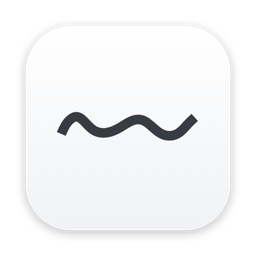
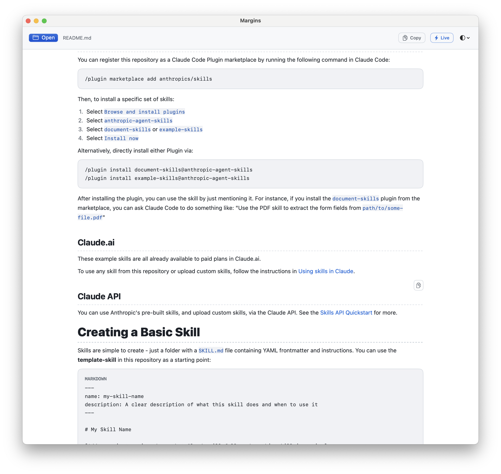

<p align="center">
  
</p>

<h1 align="center">Margins</h1>

<p align="center">
  <a href="https://github.com/Chrismacolor/margins/releases/latest"></a>
  <a href="https://github.com/Chrismacolor/margins/releases"></a>
  <a href="LICENSE"></a>
  
  
</p>

A native Markdown reader for macOS. It opens `.md` files instantly, renders them
with clean typography, and does nothing else. No web view, no bundled
JavaScript, no plugins, no setup.

<p align="center">
  
</p>

- **100% native** — SwiftUI/AppKit rendering. No embedded browser, no Chromium,
  no WebKit. Markdown is parsed and drawn natively.
- **Tiny** — no vendored engines or JS payloads; the app bundle stays small.
- **Private & offline** — your files never leave your machine; no analytics.
- **Dark / light** — follows the macOS appearance, with a manual override.
- **Live reload** — edits on disk update the view instantly (toggle in the header).
- **Find** — `⌘F` searches the document with match highlighting and quick navigation.
- **Frontmatter** — YAML metadata (`---` blocks) renders as a tidy properties panel.

Margins is deliberately minimal. If you want Mermaid diagrams, LaTeX, PDF export,
and a dozen themes, other viewers do that — Margins is for people who just want
to read Markdown, cleanly and natively.

## Install

> **Requires:** macOS 13 (Ventura) or later, on Apple Silicon.

Pick one of the two options below.

### Option A — Homebrew (recommended)

1. If you don't already have [Homebrew](https://brew.sh), install it first.
2. Install Margins:
   ```bash
   brew install --cask Chrismacolor/tap/margins
   ```
3. Launch **Margins** from Spotlight or `/Applications`.

To update later: `brew upgrade`.

### Option B — Direct download

1. Download the latest `Margins-x.y.z.dmg` from the
   [Releases](https://github.com/Chrismacolor/margins/releases) page.
2. Double-click the `.dmg` to open it.
3. Drag **Margins** into the **Applications** folder.
4. Eject the disk image, then launch **Margins** from `/Applications`.

The app is signed and notarized, so it opens without Gatekeeper warnings. To
update, download a newer `.dmg` and repeat.

## Open Markdown

Open a file any of these ways:

1. In Margins, click **Open** in the toolbar and choose a file.
2. In Finder, right-click a `.md` file → **Open With → Margins**.
3. Drag a `.md` file onto the Margins window.

Supported extensions: `.md`, `.markdown`, `.mdown`.

### Make Margins the default for Markdown

1. In Finder, right-click any `.md` file → **Get Info**.
2. Under **Open with**, choose **Margins**.
3. Click **Change All…** to apply it to every `.md` file.

## Build from source

**Prerequisites:** macOS 13+ and the Xcode command line tools — install them with
`xcode-select --install`.

1. Clone this repo and `cd` into it.
2. Build the app:
   ```bash
   ./scripts/build_app.sh      # → build/Margins.app (optimized, Apple Silicon)
   ```
3. *(Optional)* Install it to `/Applications`:
   ```bash
   ./scripts/install_app.sh    # builds, then copies to /Applications (uses sudo)
   ```

Other scripts:

- `./scripts/test.sh` — run the parser tests + parse benchmark.
- `./scripts/release.sh` — sign + notarize + package a DMG (needs a Developer ID).

`build_app.sh` honors `SWIFT_OPT=-Onone` for faster debug builds and stamps the
version from the latest git tag.

## Performance

Margins launches and opens typical documents (well under 100 KB) in a few
milliseconds. Larger files parse on a background task so the window never
freezes; files are capped at 20 MB (truncated with a notice) to keep memory
bounded. Parser benchmark (`scripts/test.sh`, Apple Silicon, release build):

| Document size | Parse time |
|:--------------|-----------:|
| 100 KB        | ~50 ms     |
| 1 MB          | ~0.4 s     |
| 10 MB         | ~3.9 s     |

## Architecture

Two Swift files compiled into one binary:

- `Sources/Margins/MarkdownRenderer.swift` — a SwiftUI-free Markdown parser that
  produces theme-independent blocks (unit-testable standalone, and a theme switch
  never re-parses).
- `Sources/Margins/main.swift` — the SwiftUI app, theme, and views that apply
  colors/fonts at render time.

Tests live in `Tests/` and run via `swiftc` (no Swift Package Manager).

## Distribution / CI

- `.github/workflows/ci.yml` builds and runs tests on every push/PR.
- `.github/workflows/release.yml` signs, notarizes, and publishes a DMG when a
  `v*` tag is pushed (see the file for the required secrets).
- `homebrew/margins.rb` is the cask; copy it into the tap repo and bump
  `version` + `sha256` (printed by `release.sh`) for each release.
